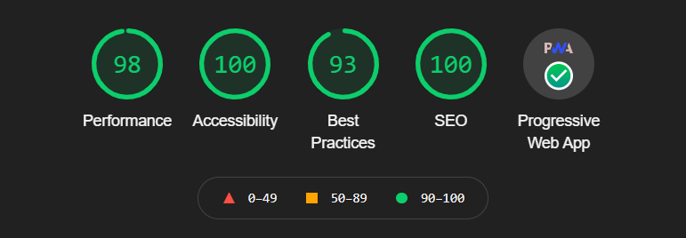

#     React PWA | this.weather App

This project was bootstrapped with [Create React App](https://github.com/facebook/create-react-app)
<br/>
<br/>


[](https://app.netlify.com/sites/thisdotweather/deploys)
<br/>

# ⛅ this.weather

💡 <b style="letter-spacing:1.6px">Website : </b><a href="https://thisdotweather.netlify.app/">this.weather</a>
<br/>

    Watch the weather in your city and received hourly forecast, including data of wind, cloudiness, 
    pressure, humidity, time of sunrise and sunset, geo coords on this.weather React PWA App

<br/>

# 🚀 Key Features
- Current location weather report.
- Searchable weather report for cities.
- Detailed weather report.
- Dynamic theme according to weather type.
- Dynamic weather type icon.
- Progressive Web Application { PWA }
- Responsive
- Offline ready
- Installable ( add to Homescreen )
- Multi-Platform Support
<br/>

# 🎯 this.weather Info
💡 Developed by <a href="https://github.com/debrajhyper">Debraj Karmakar</a>
<br/>

>I wanted to learn how to make apps using React. So, I start my journey by simply create <a href="https://github.com/debrajhyper/this.weather">this</a> normal <a href="https://reactjs.org/">react website</a>. But later I came to know about <a href="https://web.dev/progressive-web-apps/">PWA</a> so I tried <a href="https://github.com/debrajhyper/this.weather">this</a> react project to convert it into a fully responsive react PWA.
After focusing on many minor details finally I made <a href="https://github.com/debrajhyper/this.weather">this responsive react PWA.</a>
<br/>

⚙ <b style="letter-spacing:1.2px">Technology Used :</b>
<ul>
    <li>npm</li>
    <li>Webpack</li>
    <li>PWA</li>
    <li>HTML5</li>
    <li>CSS3</li>
    <li>Bootstrap</li>
    <li>React JS</li>
    <li>Fetch API</li>
    <li>lottiefiles</li>
    <li>Github</li>
    <li>VS Code</li>
    <li>Chrome</li>
    <li>Netlify</li>
</ul>
<br/>

# 📥 API
<b style="letter-spacing:1px">Weather data is retrieved from</b>
* Open Weather map: <a href="https://openweathermap.org/">openweathermap.org/</a>

* Current weather data: <a href="https://openweathermap.org/current">openweathermap.org/current</a>

* Weather Conditions: <a href="https://openweathermap.org/weather-conditions#Weather-Condition-Codes-2">openweathermap.org/weather-conditions#Weather-Condition-Codes-2</a>
<br/>

# 📊 Latest PageSpeed Insights Score
<p align="center">


</p>
<br/>

# 📌 Latest Google Lighthouse audit
<p align="center">

</p>
<br/>

# 💾 Screenshots
    
<h3>💻 Desktop | this.weather</h3>
<p align="center">
    
    
    
    
</p>

<h3>📱 Mobile | this.weather</h3>
<p align="center">
    
    
    
    
</p>
<br/>

# 💻 Running
## Clone & install

+ Clone this repo `git@github.com:debrajhyper/this.weather.git`
+ Goto `$ cd this.weather`
+ type `$ npm install`
+ run `$ npm start`

## API keys
+ Get your API key from <a href="https://openweathermap.org/">http://openweathermap.org/</a>
+ Create a new file `src/apiKeys.js`:

```jsx
const api = {
  key: "YOUR_KEY_HERE",
  base: "https://api.openweathermap.org/data/2.5/"
};

export default api;
```
<br/>

# 🧾 MIT License
## License Released under the [MIT License](http://opensource.org/licenses/MIT).

Copyright (c) 2021 <a href="https://github.com/debrajhyper">Debraj Karmakar</a>

Permission is hereby granted, free of charge, to any person obtaining a copy
of this software and associated documentation files (the "Software"), to deal
in the Software without restriction, including without limitation the rights
to use, copy, modify, merge, publish, distribute, sublicense, and/or sell
copies of the Software, and to permit persons to whom the Software is
furnished to do so, subject to the following conditions:

The above copyright notice and this permission notice shall be included in all
copies or substantial portions of the Software.

THE SOFTWARE IS PROVIDED "AS IS", WITHOUT WARRANTY OF ANY KIND, EXPRESS OR
IMPLIED, INCLUDING BUT NOT LIMITED TO THE WARRANTIES OF MERCHANTABILITY,
FITNESS FOR A PARTICULAR PURPOSE AND NONINFRINGEMENT. IN NO EVENT SHALL THE
AUTHORS OR COPYRIGHT HOLDERS BE LIABLE FOR ANY CLAIM, DAMAGES OR OTHER
LIABILITY, WHETHER IN AN ACTION OF CONTRACT, TORT OR OTHERWISE, ARISING FROM,
OUT OF OR IN CONNECTION WITH THE SOFTWARE OR THE USE OR OTHER DEALINGS IN THE
SOFTWARE.
<br/>

# 📩 Feedback

Feedback is always welcome. Feel free to contact me, I would love to know if you notice something that can be done better. Please be nice, this is my first React PWA.
<br>

```javascript
if (_.isAwesome(thisRepo)) {
  thisRepo.star(); // thanks in advance :p
}
```
