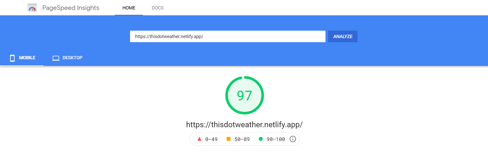
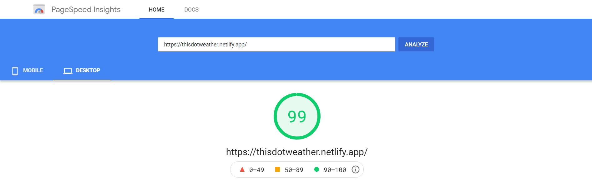

#     React PWA | this.weather App

This project was bootstrapped with [Create React App](https://github.com/facebook/create-react-app).
<br/>

# ⛅ this.weather

💡 <b style="letter-spacing:1.6px">Website : </b><a href="https://thisdotweather.netlify.app/">this.weather</a>
<br/>

    Watch the weather in your city and received hourly forecast, including data of wind, cloudiness, 
    pressure, humidity, time of sunrise and sunset, geo coords on this.weather React PWA App

<br/>

# 🚀 Key Features
- Current location weather report.
- Searchable weather report for cities.
- Detailed weather report.
- Dynamic theme according to weather type.
- Dynamic weather type icon.
- Progressive Web Application { PWA }
- Responsive
- Offline ready
- Installable ( add to Homescreen )
- Multi-Platform Support
<br/>

# 🎯 this.weather Info
💡 Developed by <a href="https://github.com/debrajhyper">Debraj Karmakar</a>
<br/>

>I wanted to learn how to make apps using React. So, I start my journey by simply create <a href="https://github.com/debrajhyper/this.weather">this</a> normal <a href="https://reactjs.org/">react website</a>. But later I came to know about <a href="https://web.dev/progressive-web-apps/">PWA</a> so I tried <a href="https://github.com/debrajhyper/this.weather">this</a> react project to convert it into a fully responsive react PWA.
After focusing on many minor details finally I made <a href="https://github.com/debrajhyper/this.weather">this responsive react PWA.</a>
<br>

⚙ <b style="letter-spacing:1.2px">Technology Used :</b>
<ul>
    <li>npm</li>
    <li>Webpack</li>
    <li>PWA</li>
    <li>HTML5</li>
    <li>CSS3</li>
    <li>Bootstrap</li>
    <li>React JS</li>
    <li>Fetch API</li>
    <li>lottiefiles</li>
    <li>Github</li>
    <li>VS Code</li>
    <li>Chrome</li>
    <li>Netlify</li>
</ul>
<br/>

# 📥 API
<b style="letter-spacing:1px">Weather data is retrieved from</b>
* Open Weather map: <a href="https://openweathermap.org/">openweathermap.org/</a>

* Current weather data: <a href="https://openweathermap.org/current">openweathermap.org/current</a>

* Weather Conditions: <a href="https://openweathermap.org/weather-conditions#Weather-Condition-Codes-2">openweathermap.org/weather-conditions#Weather-Condition-Codes-2</a>
<br/>

# 📊 Latest PageSpeed Insights Results

<br/>

# 💻 Running
## Clone & install

+ Clone this repo `git clone git@github.com:debrajhyper/this.weather`
+ `cd this.weather`
+ run `npm install`

## API keys
+ Get your API key from <a href="https://openweathermap.org/">http://openweathermap.org/</a>
+ Create a new file `src/apiKeys.js`:

```jsx
const api = {
  key: "YOUR_KEY_HERE",
  base: "https://api.openweathermap.org/data/2.5/"
};

export default api;
```

<!-- ## License

Released under the [MIT License](http://opensource.org/licenses/MIT). -->

# Feedback

Feedback is always welcome. Feel free to contact me, I would love to know if you notice something that can be done better. Please be nice, this is my first React PWA.
<br>

```javascript
if (_.isAwesome(thisRepo)) {
  thisRepo.star(); // thanks in advance :p
}
```
